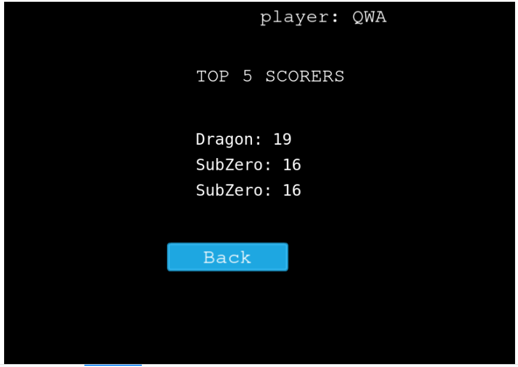

# platform-game(Endless Runner)

> An online platform game created using the Phaser framework. It's an endless running game where the player jumps over gaps of different widths whiles picking coins to accumulate  more points.

## Live Demo

[Click here](https://sweetrunner.netlify.app/) to launch and play.

## Built with

* Phaser3
* Webpack
* Javascript
* Eslint
* Babel
* Jest testing framework
* [Leaderboard API service](https://www.notion.so/Leaderboard-API-service-24c0c3c116974ac49488d4eb0267ade3) - saving and fetching players' scores

## Getting Started

### Getting a local copy

> To clone the repository, copy the project's remote url and in your terminal, do the following.

1. ```bash git clone <https://github.com/JelilFaisalAbudu/platform-game.git>```

2. Navigate to the directory you've clone the project into and open it in your favorite code editor

> Downloading the zip file of the project

1. Click the zip icon from the dropdown menu to download the zip file onto your machine.

2. Unzip the downloaded file and open it using your favorite code editor

### Installations

Make sure you have node.js installed on you machine.
To check whether or not you have node.js installed on your machine, run ```node -v``` in your terminal.
If everything went well, you should see a terminal output that indicates the version of the installed node.
Otherwise, [click this](https://nodejs.org/en/download/) link to install one before you proceed.

* Run the following commands in your terminal.

1.```npm install``` to install the project's dependencies

2.```npm start``` to start the development server and also open the game in your browser.

## Unit Test

* Run ```npm run test``` to test code and also any future test you may write.

## Game screenshots




## Author

👤 **Jelil Faisal Abudu**

* Github: [JelilFaisalAbudu](https://github.com/JelilFaisalAbudu)
* Twitter: [@jelilabudu](https://twitter.com/jelilabudu)
* Linkedin: [jelilfaisalabudu](www.linkedin.com/in/jelilfaisalabudu)

## Acknowledgments

### Game template and game examples

* Creating phaser 3 game template was inspired by [Zenva](https://phasertutorials.com/creating-a-phaser-3-template-part-3/)
* Actual game example and tutorials was inspired by [Emanuele Feronato](https://www.emanueleferonato.com/tag/endless-runner/)

### Game assets

* All sound bits were obtained from [gameart](https://gameart.org/)
* 2D character sprite was obtained from [gameart2d](https://www.gameart2d.com/freebies.html)

## 🤝 Contributing

Contributions, issues and feature requests are welcome!

Feel free to check the [issues page](https://github.com/JelilFaisalAbudu/platform-game/issues)

## Show your support

Give a ⭐️ if you like this project!

## 📝 License

This project is free to use as learning purposes. For any external content (e.g. logo, images, ...), please contact the proper author and check their license of use.
